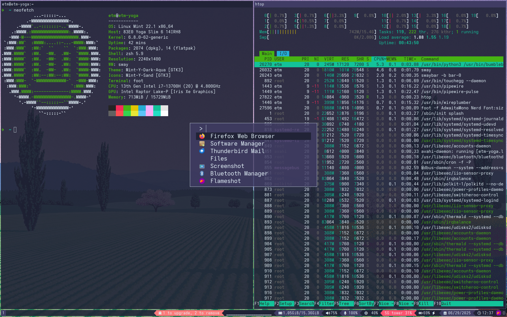

# MintySway

Sway window manager setup for **Linux Mint Cinnamon (latest version)**.

> **Note:**  
> This configuration is **designed for and only tested on Linux Mint Cinnamon Edition (latest release)**.  
> It is a **single, all-in-one config file**—no scattered dotfiles or directories.  
> All setup, usage, and customization instructions are clearly documented as comments in the config file itself.

1. **Read the config:**  
   All setup, usage, and customization instructions are included as comments in the single config file (`~/.config/sway/config`).

For more about Sway itself, see the [Sway Wiki](https://github.com/swaywm/sway/wiki).
